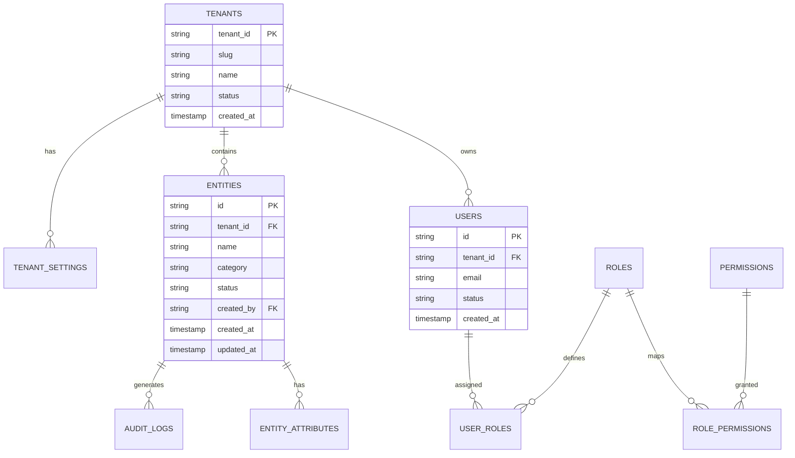

# Table Relationships & Schema Architecture

Overview of core database entities, foreign key references, and multi-tenant partitioning conventions.

---

## 🗺️ Entity Relationship Diagram

---

## 🔒 Multi-Tenant Data Isolation Principles

1. **Discriminator Column**: Every domain table MUST contain a non-nullable `tenant_id VARCHAR(64)` column.
2. **Compound Indexes**: Composite primary keys or indexes should lead with `tenant_id` for efficient indexing (e.g., `INDEX idx_entities_tenant_category (tenant_id, category)`).
3. **Foreign Key Restraints**: Cross-tenant relationships are strictly forbidden. Foreign keys must refer to parent tables within the same tenant scope.

---

## 🏷️ Tags
#database #schema #er-diagram #foreign-keys #multi-tenant
